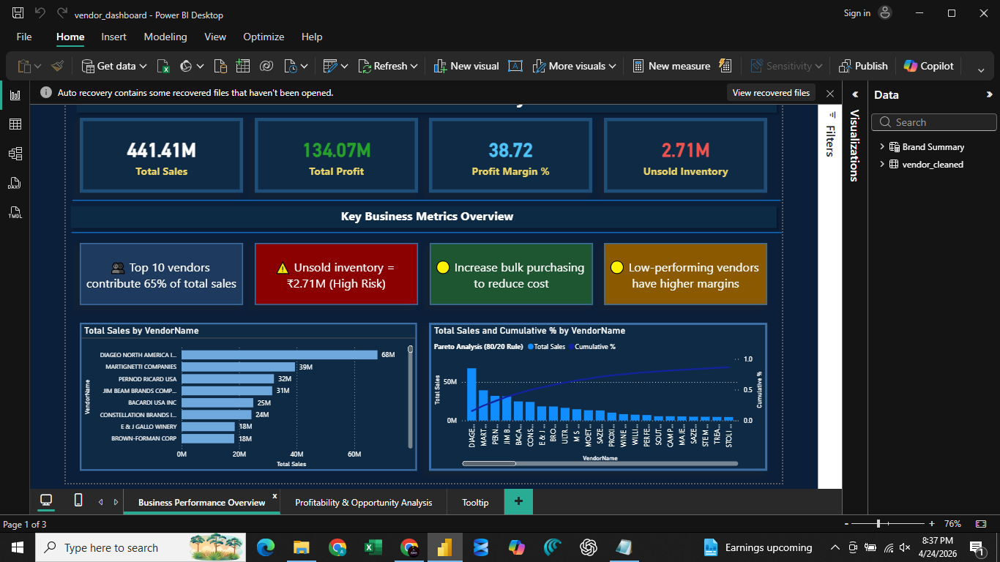
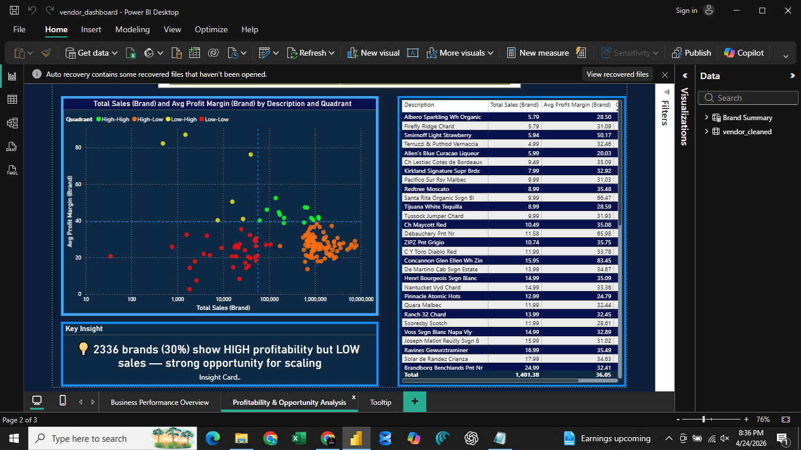

# 🚀 Vendor Performance & Inventory Optimization Analysis

---

## 📌 Overview

This project analyzes vendor-level sales, purchasing behavior, and inventory efficiency to generate actionable business insights.

The objective is to help businesses optimize vendor selection, pricing strategies, and inventory management using data-driven decision-making.

---

## 🧠 Problem Statement

Organizations working with multiple vendors often face:

* Over-dependence on a limited number of vendors
* Inefficient inventory management
* Capital locked in unsold stock
* Difficulty identifying high-profit opportunities

This project addresses these challenges through structured data analysis.

---

## 🎯 Objectives

* Evaluate vendor and product performance
* Identify high-margin but low-sales products
* Analyze inventory turnover and inefficiencies
* Measure vendor dependency using Pareto analysis
* Optimize bulk purchasing strategies
* Perform statistical validation on profitability differences

---

## 🛠️ Tools & Technologies

* **SQL Server (SSMS)** – Data extraction
* **Python (Pandas, NumPy)** – Data analysis
* **Matplotlib & Seaborn** – Data visualization
* **SciPy** – Statistical analysis
* **Power BI** – Dashboard and reporting

---

## 📂 Dataset

* Source: SQL Server Database (`vendor_sales_summary`)
* Total Records: ~10,000+
* Features include:

  * Vendor details
  * Sales & purchase metrics
  * Profit margins
  * Inventory indicators

---

## 📊 Dashboard Preview

### 📌 Sales Overview



### 📌 Vendor & Inventory Insights



---

## 🔍 Key Analysis

### 📊 1. Data Cleaning

* Filtered only meaningful data
* Removed invalid and zero-value transactions

---

### 📊 2. Exploratory Data Analysis

* Distribution plots
* Outlier detection
* Correlation analysis

**Key Insight:**

* Purchase price has minimal impact on revenue and profit
* Sales and purchase quantities are highly correlated

---

### 📊 3. High-Margin Low-Sales Products

* Identified products with:

  * Low sales (bottom 15%)
  * High margins (top 85%)

👉 Business Opportunity: Promotion and pricing optimization

---

### 📊 4. Top Vendor Analysis

Top vendors contributing major sales:

* DIAGEO NORTH AMERICA
* MARTIGNETTI COMPANIES
* PERNOD RICARD

---

### 📊 5. Pareto Analysis

* Top 10 vendors contribute **~65% of total purchases**

👉 Insight: High dependency risk on limited vendors

---

### 📊 6. Bulk Purchasing Impact

| Order Size | Avg Unit Price |
| ---------- | -------------- |
| Small      | $39.05         |
| Medium     | $15.48         |
| Large      | $10.77         |

👉 Bulk purchasing reduces cost by ~72%

---

### 📊 7. Inventory Analysis

* Identified low stock turnover vendors
* Highlighted slow-moving inventory

---

### 📊 8. Unsold Inventory

* Total capital locked: **~$2.71M**

👉 Insight: Significant working capital inefficiency

---

### 📊 9. Statistical Analysis

* Conducted hypothesis testing
* Found significant difference in profit margins between:

  * High-performing vendors
  * Low-performing vendors

---

## 💰 Business Impact

* Identified **$2.7M+ capital locked in inventory**
* Highlighted **65% vendor dependency risk**
* Discovered **high-margin low-sales products for growth**
* Provided **bulk purchasing insights (~72% cost reduction)**

---

## 💡 Key Business Insights

* High-margin products need better visibility
* Vendor dependency must be reduced
* Inventory management needs optimization
* Bulk purchasing strategies improve profitability
* Low-performing vendors can be scaled effectively

---

## 📁 Project Structure

```
vendor-performance-analysis/
│── vendor_analysis.ipynb
│── vendor_queries.sql
│── vendor_dashboard.pbix
│── dashboard 1.png
│── dashboard 2.png
│── README.md
```

---

## 📈 Resume Highlights

* Analyzed 10K+ records to uncover vendor performance trends
* Identified $2.7M+ capital locked in inventory
* Performed Pareto analysis showing 65% vendor dependency
* Applied statistical testing for business validation
* Delivered actionable insights for pricing and inventory optimization

---

## 🚀 Future Improvements

* Build demand forecasting model
* Automate vendor performance scoring
* Integrate real-time dashboards

---

## 🤝 Connect

If you found this project useful or want to collaborate, feel free to connect!
